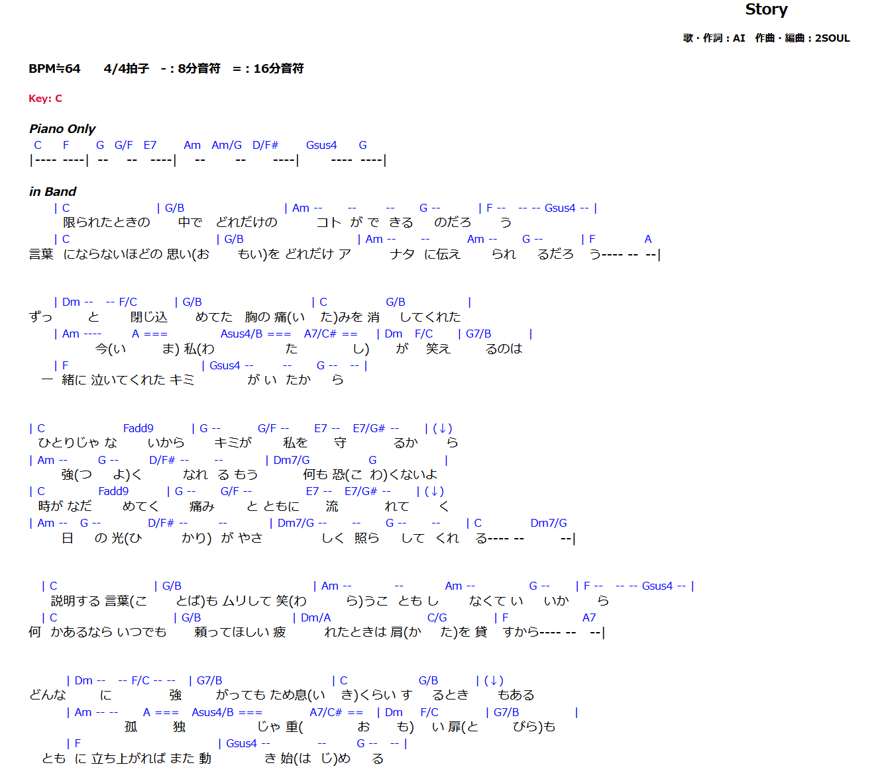
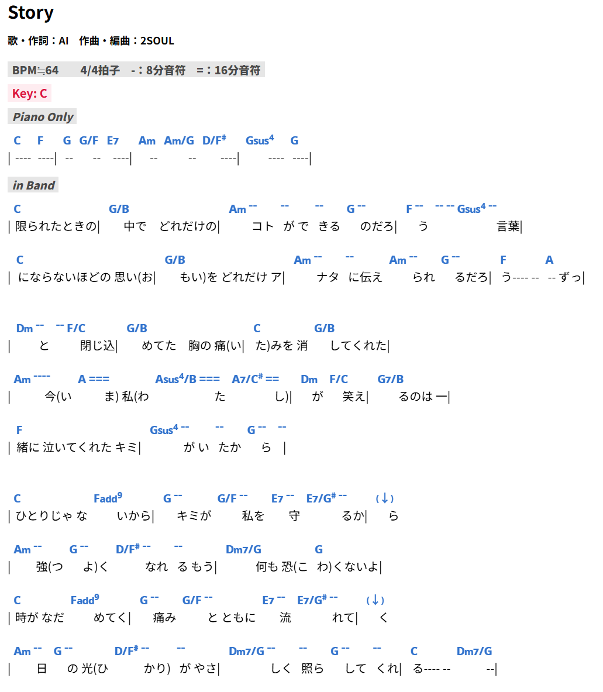

# ReplaceChar（Chrome拡張）

## なにするもの？

ChordWikiの書き方が気に入らんコード譜に対して、強制的にDOMを書き換えるChrome拡張です。Chrome拡張としては公開する気がないです。

主な機能として、

- 行頭に前の小節の最後の歌詞があるものを、前の行の最後に持って行きます（例：前の小節の４拍目から歌詞が始まるケース）
- コードの行に、「|（小節線扱い）」がある場合、歌詞の行に移行します。
- テンションコードが()で括られている場合、｛｝に置換します（作者は、MNoto Sansフォントを使っているので、上付きのテンション表示にしたいが為）
  - ちなみに、MNoto Sansフォントは[こちら](https://github.com/ykwe/MNoto-Sans-alpha)です。V2フォントを使用しています。
  - なお作者は、[Stylebot](https://chromewebstore.google.com/detail/oiaejidbmkiecgbjeifoejpgmdaleoha?utm_source=item-share-cb)というChrome拡張にて、見た目の調整をしとります。参考までに[こちら](stylebot_backup.json)に上げておきます。
  - 不要な方は、content.js 内にて正規表現で対象を絞り込んでいる箇所があるので、そこを消せば良いです。

    ```js
        span.textContent = span.textContent
          .replace(/\((?:[#b]?\d+(?:[,.][#b]?\d+)*)\)/g, match => {
          return '{' + match.slice(1, -1) + '}';
        });
    ```

- 設定用のインターフェイスなどはないので、ソース直修正して、Chrome拡張を再度読み込んで、対象のコード譜もリロードしてください。

## 例


<table>
  <tr>
    <td align="center">プレーン表示</td>
    <td align="center">適応後の表示</td>
  </tr>
  <tr>
    <td></td>
    <td></td>
  </tr>
</table>

※ もちろんですが、適応後は [Stylebot](https://chromewebstore.google.com/detail/oiaejidbmkiecgbjeifoejpgmdaleoha?utm_source=item-share-cb) にてCSSは調整済みです。

## 使い方

どこぞに、フォルダを作って、manifest.jsonと、content.jsを配置してください。

あとは、Chrome拡張にて「パッケージ化されていない拡張機能を読み込む」機能にて、ローカルのChrome拡張として実行してください。

修正したい場合、設定用のインターフェイスなどはないので、ソース直修正して、Chrome拡張を再度読み込んで、対象のコード譜もリロードしてください。

## その他

このツールを使った事でなんぞ不利益や不具合が発生しても、責任取りません。取れません。各自、ソースコードを調整してください。
